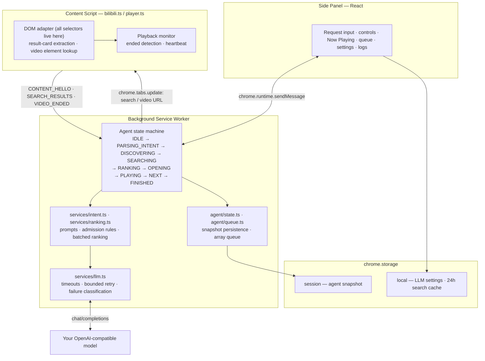

<div align="center">

# Bilibili AI Playlist Agent

**Natural-language video discovery and continuous playback for Bilibili.**

An open-source Chrome extension that turns a natural-language request into a curated Bilibili playlist —
through AI intent understanding, real video search, candidate ranking, and automated playback.

[](LICENSE)
[](https://github.com/Andyyao12/Bilibili-AI-Playlist-Agent/releases)
[](https://developer.chrome.com/docs/extensions/develop/migrate/what-is-mv3)
[](https://www.typescriptlang.org/)
[](https://github.com/Andyyao12/Bilibili-AI-Playlist-Agent/actions/workflows/ci.yml)

[English](README.md) · [简体中文](README.zh-CN.md) · [Quick Start](#quick-start) · [Demo](#demo) · [Architecture](#architecture)

</div>


> **This is an independent open-source project. It is not affiliated with, endorsed by, or produced by Bilibili.**
> It drives the public Bilibili website through a normal browser tab — no private APIs, no unofficial endpoints.

---

## Demo

A ~70 second recording of the real extension: a one-line request goes in, and the agent searches Bilibili,
ranks the actual search results, builds a playlist, then plays it back to back — advancing automatically when
each video ends.

[](https://github.com/Andyyao12/Bilibili-AI-Playlist-Agent/releases/download/v0.1.0/demo.mp4)

*Click the cover to watch the demo (MP4, ~70s, hosted as a GitHub Release asset).*

The whole pipeline runs on the real website:

```
Natural language  →  Intent understanding  →  Bilibili search  →  Content ranking
                  →  Playlist            →  Continuous playback
```

<table>
<tr>
<td width="50%">

**Side panel — driving a generated playlist**

Request, live status, Now Playing card, four-state queue, controls,
and one-line LLM settings. Everything is the real UI.

</td>
<td width="50%">


</td>
</tr>
</table>

---

## Key Features

**Intent layer**

- **Natural-language intent understanding** — the LLM returns a single JSON plan; the extension never asks you to name a specific video.
- **Three intent modes** — `explicit_playlist` (you name the works), `discovery` (you describe artist / style / topic / occasion), `hybrid` (one reference work *or* play-then-recommend).
- **Content granularity awareness** — `single` vs `collection`. Music discovery defaults to single tracks; titles carrying `合集 / 歌单 / 串烧 / 100首 / 200P / 全MV` are rejected as single-track candidates unless you asked for a collection.
- **Media-aware rules** — the negative-keyword set and duration heuristics differ per media type, so music rules never punish a tutorial (where “教学/教程” *is* the target).

**Retrieval layer**

- **Real Bilibili search + DOM extraction** — navigates to `search.bilibili.com` and reads the actual result cards. No private API, no scraping of hidden endpoints.
- **Rule-based admission before the LLM** — hard filters for negative keywords and granularity, topic relevance scored from specific terms (with automatic relaxation when the user only supplied mood/genre words).
- **BV and work-level deduplication** — same video and same work (different uploads of the same song) are collapsed.
- **One batched LLM ranking call** — up to 12 admitted candidates go to the model in a single request; it may only return candidate indices, never invent a video.

**Playback layer**

- **Automated queue playback** — opens the chosen video, detects the end of playback via the HTML5 `ended` event (`currentTime >= duration - 1` as a fallback), and advances.
- **Failure isolation** — one bad video is marked failed and skipped; the queue always continues.
- **Event-driven state recovery** — the queue and run state live in `chrome.storage.session`, so closing the side panel or having the service worker reclaimed does not stop playback.
- **Chrome MV3 Side Panel UI** — React + hand-written CSS, no UI framework.
- **Bring your own model** — any OpenAI-compatible `chat/completions` endpoint. API key stays in `chrome.storage.local`.

---

## Architecture



**Storage responsibilities**

| Area | Holds | Why |
| --- | --- | --- |
| `chrome.storage.session` | Agent snapshot: state, queue, current index, generation counter, waiting timestamps | The service worker can be reclaimed at any time. Keeping the snapshot here means the queue survives and resumes without ever touching disk. |
| `chrome.storage.local` | LLM configuration and a 24-hour search cache keyed by `title\|media_type` | Settings must persist across browser restarts. The cache skips a whole search + ranking round trip for a repeat request. |

**Tech stack**

Chrome Manifest V3 · TypeScript (strict) · React 18 · Vite 5 · Chrome Extension APIs · no backend · no database.

Runtime dependencies are just `react` and `react-dom`. There is no server, no account system, and no telemetry.

---

## How It Works

### 1. Explicit playlist — you name the works

```
帮我播放《偶然》《再别康桥》《在水一方》
```

`mode: explicit_playlist`, `items: [偶然, 再别康桥, 在水一方]`. The agent searches each title in turn
(`偶然 歌曲 完整版`), admits candidates, asks the model to pick the single best match, and plays them in order.

### 2. Discovery — you describe what you want

```
播放几首周杰伦的经典歌曲
```

`mode: discovery`, `items: []`, `search_queries: ["周杰伦 经典歌曲", "周杰伦 热门歌曲"]`.

The agent runs **every** generated query and accumulates the results (BV-deduplicated) into one pool, then performs
**one** batched ranking call over the admitted candidates and turns the picks into the playlist.
This is deliberate: a single Bilibili result page for this query is dominated by compilations (measured: 13 of 15
cards), so accumulating across queries is what makes it possible to find enough individual tracks.

### 3. Hybrid — one reference work

```
播放类似《送别》的歌曲          → 送别 is a reference only; the agent searches for similar songs
先播放《送别》，然后推荐类似的   → 送别 is played first, then similar songs extend the queue
```

The `play_reference` flag distinguishes the two. With `play_reference: false` the reference work is **never**
queued, and its style words drive the search instead.

---

## Quick Start

**Requirements:** Node.js >= 20.11 and Chrome 116+.

```bash
git clone https://github.com/Andyyao12/Bilibili-AI-Playlist-Agent.git
cd Bilibili-AI-Playlist-Agent

npm install
npm run typecheck     # tsc --noEmit on both tsconfigs
npm run build         # builds dist/ and validates every manifest reference
```

Then load it:

1. Open `chrome://extensions`
2. Enable **Developer mode** (top right)
3. Click **Load unpacked** and select the `dist/` directory
4. Open any Bilibili page and click the toolbar icon — the side panel opens on the right
5. Expand **LLM 设置**, enter your API Base URL, API Key and Model Name, then click **保存**
   (use **测试连接** to verify the connection first)
6. Type a request and hit **开始播放**

**No API key is bundled and none is required to build.** The extension ships empty and asks you to configure your own
OpenAI-compatible model:

| Field | Example | Notes |
| --- | --- | --- |
| API Base URL | `https://api.openai.com/v1` | Do **not** append `/chat/completions` |
| API Key | `sk-...` | Stored locally only |
| Model Name | `gpt-4o-mini` | Any chat-completions model |
| temperature / max_tokens | `0.3` / `800` | Optional tuning |

Works with hosted providers and local runtimes (Ollama, LM Studio, vLLM) alike.

### Development

```bash
npm run dev          # watch mode — rebuilds on change
npm run typecheck    # type-check app + build scripts
npm run build        # one-shot production build
npm run verify:llm   # run the A–F acceptance suite against your real model
```

The build orchestrates three Vite passes (side panel HTML app, service worker, content script), then copies the
manifest and generates the PNG icons, and finally asserts that every file referenced by `manifest.json` exists in `dist/`.

---

## Verification

Everything below was executed on the real codebase. The LLM **responses** are a fixture in the rule-layer tests;
the search data, HTML structure, state machine, admission rules and ranking plumbing are all real.

| Check | What it exercises | Result |
| --- | --- | --- |
| `npm run typecheck` | App and Node-side TypeScript projects | **0 errors** |
| `npm run build` | 3 Vite builds + manifest reference validation | **3/3 builds, 6/6 references resolved** |
| Rule + state-machine acceptance | Real `search.bilibili.com` HTML, real browser cards; fixture LLM that selects *every* admitted candidate (so the local rules alone decide the outcome) | **55/55 assertions** |
| LLM network reliability | Real local HTTP server producing real failures: 429, 5xx, TCP resets, timeouts, non-JSON bodies, malformed output, empty content | **41/41 assertions** |
| `verify:llm` harness end-to-end | The shipped acceptance script driven against a mock endpoint (which forces a real network failure on one case) + real Bilibili search | **20/20 assertions** |
| Content-script extraction in a real browser | Built `dist/content.js` injected into live Bilibili pages | 15/15 candidates with complete fields; real `ended` event reported with `sessionId` / `itemId` / `bvId` |
| Chrome extension playback | Loaded unpacked in Chrome: request → search → pick → play → auto-advance | Verified manually on real videos |

**About the acceptance suite.** `npm run verify:llm` runs six end-to-end cases (A–F) against *your* model:

| Case | Request | Expectation |
| --- | --- | --- |
| A | Play 5 classic Jay Chou songs | individual tracks, not compilations |
| B | Play some quiet light music for the evening | stay on topic, no unrelated content |
| C | Find 5 Python beginner tutorials | no cross-domain results (e.g. Blender) |
| D | Play songs similar to 《送别》 | the reference work is not queued first |
| E | Play a Jay Chou song collection | collections are allowed here, not mis-filtered |
| F | Play three named songs | the explicit-playlist flow is unchanged |

A single failing case does **not** abort the run: the suite continues, prints a per-case summary with the intent
JSON, the real candidate pool and the resulting queue, and tallies failures by class
(`network` / `http` / `parse` / `empty`).

Current real-model status: **case A passed** against a live model. Case B hit a transient
`fetch failed` network error, which is now handled by the bounded retry added in the reliability pass
(up to 3 attempts with backoff for network errors, 429 and 5xx; never retried for 400/401/403 or malformed output).
Re-run `npm run verify:llm` with your own credentials to reproduce the full A–F table — the project does not ship
any API key, so this suite cannot be executed in CI.

---

## Security & Privacy

- **No backend, no account, no telemetry.** The extension talks to exactly two places: the Bilibili website in your
  own browser tab, and the model endpoint **you** configure.
- **Your API key never leaves your machine except to your model provider.** It is stored in
  `chrome.storage.local`, is never written to logs, and is never committed to this repository.
- **Log redaction is enforced in code.** `src/utils/logger.ts` scrubs registered secrets plus `Bearer …`, `sk-…`
  and `api_key` patterns on every log line. Request logging records only the endpoint (with query string stripped),
  the model name, error codes and timings — never the `Authorization` header or the request body.
- **Permissions.** `storage`, `tabs`, `sidePanel`, `scripting`, `alarms`, and `<all_urls>` host permission.
  The broad host permission is required because *you* choose the model base URL at runtime — the extension cannot
  declare an unknown origin ahead of time. The content script is only registered for `www.bilibili.com` and
  `search.bilibili.com`, and it acts on a tab only after a handshake confirms that tab is the one the agent controls.
- **Nothing is promised beyond what the code does.** The extension deliberately avoids private Bilibili APIs;
  it is subject to the same rate limits and page changes as a normal user.

### Reporting a vulnerability

See [SECURITY.md](SECURITY.md). Please do not open a public issue for security problems.

---

## Limitations

- **Bilibili DOM changes can break extraction.** Every selector lives in a single file
  (`src/content/bilibili.ts`) with multi-level fallbacks, but a redesign on Bilibili's side may still require a fix.
  `data-v-*` scoped-CSS attributes are deliberately never used.
- **Search results are non-deterministic.** Bilibili personalises and rotates results, so the same request can yield
  a different playlist between runs — and occasionally fewer items than requested.
- **A shorter queue than requested is intentional.** When not enough qualified candidates pass admission,
  the agent stops rather than padding the queue with irrelevant content. Real-world example: a query whose result
  page is 13/15 compilations cannot produce five individual tracks.
- **Recommendation quality depends on the candidate pool and the model you choose.** Local rules cannot handle
  synonyms — mood/genre requests (light music, sleep) automatically relax topic matching and leave the semantic
  call to the LLM.
- **Known rule gaps (documented, not hidden):** Chinese numerals (“十首歌曲”) are not recognised as a collection
  marker; a concert video whose title lacks `合集/演唱会` keywords is admitted and only slightly demoted;
  work-level deduplication merges identical or long-prefix title fingerprints only — an artist's name merely
  *appearing* in a title (covers, other artists' performances) is demoted but not excluded.
- **Multi-part and collection videos** are treated as a single queue item; the agent does not walk through parts.
- **Browser autoplay policy applies.** If Chrome blocks `play()`, the panel asks you to click the video area;
  playback that never starts within 45 seconds is marked failed and skipped. Audio is never force-muted.
- **The side panel UI is Chinese-only.** Code, comments and documentation are written for an international
  audience, but the in-product strings are Simplified Chinese. Adding localisation is on the roadmap.
- **Chrome 116+ desktop only.** No Firefox, Safari, or mobile support.

---

## Contributing

Contributions are welcome — bug reports, selector fixes and better ranking heuristics especially.
Please read [CONTRIBUTING.md](CONTRIBUTING.md) first; it documents the coding conventions that keep this project
maintainable (in particular: no bare `fetch` for LLM calls, all Bilibili selectors in one file, no `data-v-*` selectors).

```bash
npm install
npm run typecheck && npm run build   # must pass before opening a PR
```

## License

[MIT](LICENSE) © Andyyao12

---

<div align="center">

If this project is useful to you, a star helps others find it.
Issues and pull requests are the fastest way to get something fixed.

</div>
