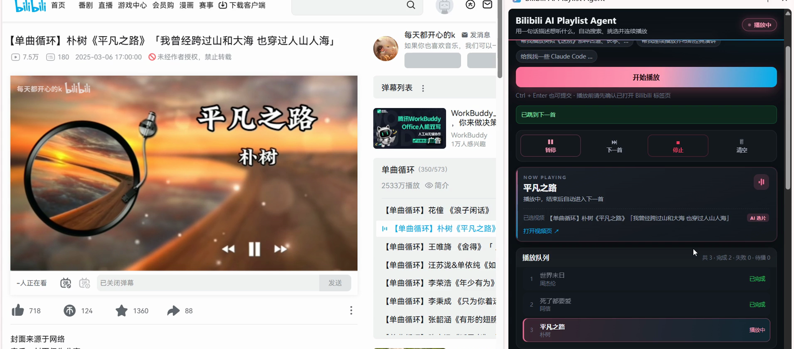
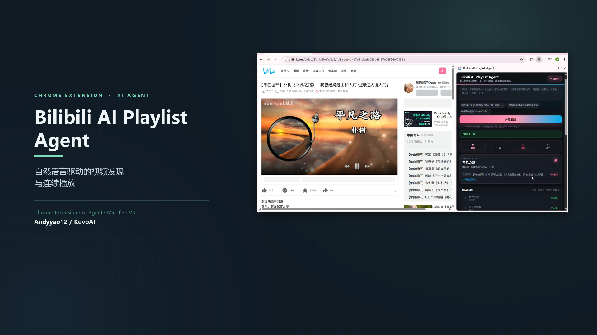
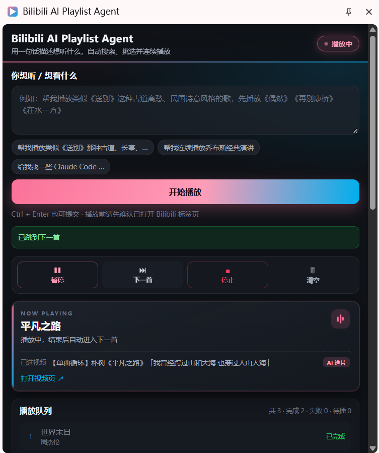
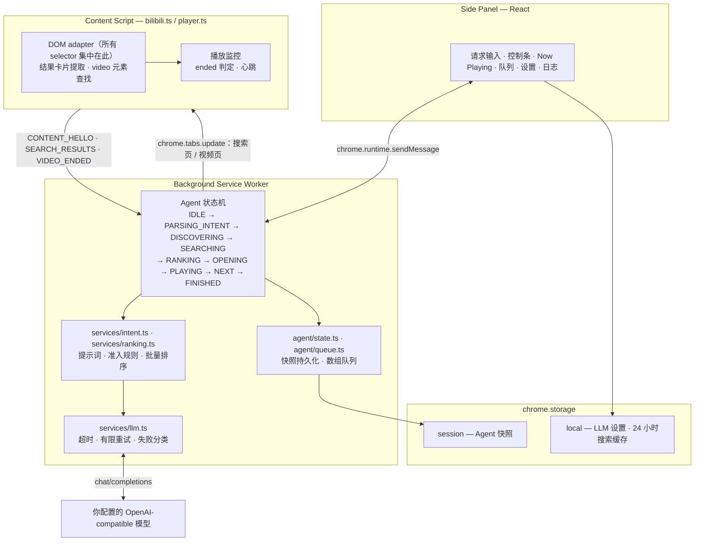

<div align="center">

# Bilibili AI Playlist Agent

**用一句自然语言，完成 B 站的内容发现与连续播放。**

一个开源 Chrome 扩展：把自然语言请求变成 B 站播放队列 —— 由 AI 理解意图、真实搜索视频、对候选排序，并自动连续播放。

[](LICENSE)
[](https://github.com/Andyyao12/Bilibili-AI-Playlist-Agent/releases)
[](https://developer.chrome.com/docs/extensions/develop/migrate/what-is-mv3)
[](https://www.typescriptlang.org/)
[](https://github.com/Andyyao12/Bilibili-AI-Playlist-Agent/actions/workflows/ci.yml)

[English](README.md) · [简体中文](README.zh-CN.md) · [快速开始](#快速开始) · [演示](#演示) · [架构](#架构)

</div>



> **这是一个独立开源项目，与哔哩哔哩官方无任何关联，也不代表官方立场。**
> 它通过在普通浏览器标签页里操作公开的 B 站网页来工作 —— 不使用任何私有 API 或非官方接口。

---

## 演示

一段约 70 秒的真实录屏：输入一句话请求，Agent 在 B 站真实搜索、对真实搜索结果排序、生成播放队列，
然后连续播放，并在每个视频结束时自动切换下一个。

[](https://github.com/Andyyao12/Bilibili-AI-Playlist-Agent/releases/download/v0.1.0/demo.mp4)

*点击封面观看演示（MP4，约 70 秒，托管在 GitHub Release Assets）。*

<sub>演示视频包含来自 B 站的第三方音乐，仅用于产品功能演示。</sub>

整条链路都跑在真实网站上：

```
自然语言  →  意图理解  →  B 站搜索  →  内容排序  →  播放队列  →  连续播放
```

<table>
<tr>
<td width="50%">

**侧边面板 —— 驱动一个自动生成的播放队列**

输入框、实时状态、Now Playing 卡片、四态队列、控制按钮，
以及一行配置的模型设置，全部是真实界面。

</td>
<td width="50%">



</td>
</tr>
</table>

---

## 核心特性

**意图层**

- **自然语言意图理解** —— 模型只返回一份 JSON 计划，**不要求**用户点名具体视频。
- **三种意图模式** —— `explicit_playlist`（点名作品）、`discovery`（描述歌手/风格/主题/场景）、`hybrid`（参考作品，或"先播再推荐"）。
- **内容粒度识别** —— `single` 与 `collection`。音乐 discovery 默认以单曲为单位；标题含 `合集 / 歌单 / 串烧 / 100首 / 200P / 全MV` 的视频不会作为单曲候选，除非你明确要合集。
- **按媒体类型区分的规则** —— 负向词与时长启发式按媒体类型分别配置，音乐规则不会误伤教程（教程场景下「教学/教程」正是目标）。

**检索层**

- **真实 B 站搜索 + DOM 提取** —— 跳转 `search.bilibili.com` 并读取真实结果卡片，不依赖私有 API。
- **LLM 之前先做规则准入** —— 对负向词与内容粒度做硬过滤；主题相关性由具体词打分，并在用户只给了情绪/体裁词时自动放宽。
- **BV 与作品级去重** —— 同一视频、以及同一作品的多个上传版本都会被收敛。
- **一次批量 LLM 排序** —— 最多 12 条准入候选一次性交给模型，模型只能返回候选编号，不能虚构视频。

**播放层**

- **自动队列播放** —— 打开选中的视频，用 HTML5 `ended` 事件判定播放结束（备选 `currentTime >= duration - 1`），然后自动切下一个。
- **失败隔离** —— 单个视频失败只会被标记并跳过，队列永远继续。
- **事件驱动状态恢复** —— 队列与运行状态写入 `chrome.storage.session`，关闭侧边面板或 service worker 被回收都不会中断播放。
- **Chrome MV3 侧边面板界面** —— React + 手写 CSS，不引入 UI 框架。
- **自带模型** —— 任何 OpenAI-compatible 的 `chat/completions` 服务。API Key 只存在 `chrome.storage.local`。

---

## 架构



**存储职责划分**

| 区域 | 存放内容 | 原因 |
| --- | --- | --- |
| `chrome.storage.session` | Agent 快照：状态、队列、当前下标、代数计数器、等待时间戳 | service worker 随时可能被回收。放在 session 里可以让队列存活并续跑，同时完全不落盘。 |
| `chrome.storage.local` | LLM 配置，以及 key 为 `标题\|媒体类型` 的 24 小时搜索缓存 | 设置需要跨浏览器重启保留；缓存能让重复请求省掉一整轮搜索 + 排序。 |

**技术栈**

Chrome Manifest V3 · TypeScript（strict）· React 18 · Vite 5 · Chrome Extension APIs · **无后端、无数据库**。

运行依赖只有 `react` 与 `react-dom`。没有服务器、没有账号体系、没有埋点。

---

## 工作方式

### 1. 明确清单 —— 你点名作品

```
帮我播放《偶然》《再别康桥》《在水一方》
```

`mode: explicit_playlist`，`items: [偶然, 再别康桥, 在水一方]`。Agent 依次搜索每个标题
（`偶然 歌曲 完整版`），做准入过滤，让模型选出最匹配的一个，再按顺序播放。

### 2. 发现式 —— 你描述想要什么

```
播放几首周杰伦的经典歌曲
```

`mode: discovery`，`items: []`，`search_queries: ["周杰伦 经典歌曲", "周杰伦 热门歌曲"]`。

Agent 会跑完**全部**搜索词，把结果按 BV 去重后累积成一个候选池，然后**只发一次**批量排序请求，
把模型选中的结果直接变成播放队列。这是有意设计的：该查询的单个 B 站结果页被合集占满
（实测 15 张卡片里 13 张是合集），跨关键词累积才能凑出足够的独立单曲。

### 3. 参考作品 —— hybrid

```
播放类似《送别》的歌曲          → 《送别》只作参考，Agent 去搜同类歌曲
先播放《送别》，然后推荐类似的   → 先播《送别》，播完再用同类歌曲扩充队列
```

两者由 `play_reference` 区分。当 `play_reference: false` 时，参考作品**绝不会**进入队列，
它的风格词只用来检索。

---

## 快速开始

**环境要求：** Node.js >= 20.11、Chrome 116+。

```bash
git clone https://github.com/Andyyao12/Bilibili-AI-Playlist-Agent.git
cd Bilibili-AI-Playlist-Agent

npm install
npm run typecheck     # 两个 tsconfig 都做 tsc --noEmit
npm run build         # 构建 dist/ 并校验 manifest 里的每个引用
```

然后加载扩展：

1. 打开 `chrome://extensions`
2. 打开右上角 **开发者模式**
3. 点击 **加载已解压的扩展程序**，选择 `dist/` 目录
4. 打开任意 B 站页面，点击工具栏图标 —— 右侧弹出侧边面板
5. 展开 **LLM 设置**，填入 API Base URL、API Key、Model Name，点击 **保存**
   （可先点 **测试连接** 验证连通性）
6. 输入需求，点 **开始播放**

**仓库内不含任何 API Key，构建也不需要。** 扩展默认是空的，需要你自己配置
OpenAI-compatible 模型服务：

| 字段 | 示例 | 说明 |
| --- | --- | --- |
| API Base URL | `https://api.openai.com/v1` | **不要**带 `/chat/completions` |
| API Key | `sk-...` | 只保存在本地 |
| Model Name | `gpt-4o-mini` | 任何 chat-completions 模型 |
| temperature / max_tokens | `0.3` / `800` | 可选调参 |

云端服务与本地运行时（Ollama、LM Studio、vLLM）都可用。

### 开发

```bash
npm run dev          # 监听模式，改代码自动重建
npm run typecheck    # 类型检查（应用 + 构建脚本）
npm run build        # 一次性生产构建
npm run verify:llm   # 用你的真实模型跑 A–F 验收
```

构建会编排三次 Vite 构建（侧边面板 HTML 应用、service worker、content script），再拷贝 manifest 并生成
PNG 图标，最后断言 `manifest.json` 引用的每个文件都真实存在于 `dist/`。

---

## 验证情况

以下结果全部在真实代码库上执行得出。规则层测试里的 **LLM 响应是夹具**；
但搜索数据、HTML 结构、状态机、准入规则与排序链路都是真实的。

| 检查项 | 覆盖内容 | 结果 |
| --- | --- | --- |
| `npm run typecheck` | 应用侧与 Node 侧 TypeScript 工程 | **0 错误** |
| `npm run build` | 三次 Vite 构建 + manifest 引用校验 | **3/3 构建通过，6/6 引用可解析** |
| 规则 + 状态机验收 | 真实 `search.bilibili.com` HTML 与真实卡片结构；夹具 LLM 策略为"选中全部准入候选"（因此结果完全由本地规则决定） | **55/55 断言通过** |
| LLM 网络可靠性 | 真实本地 HTTP 服务端制造真实故障：429、5xx、TCP 重置、超时、非 JSON 响应体、格式错误、空内容 | **41/41 断言通过** |
| `verify:llm` 校验台端到端 | 用 mock 端点驱动仓库内的验收脚本（并强制其中一个用例发生真实网络故障）+ 真实 B 站搜索 | **20/20 断言通过** |
| 真实浏览器内的 content script 提取 | 把构建产物 `dist/content.js` 注入真实 B 站页面 | 15/15 候选字段完整；真实 `ended` 事件带 `sessionId` / `itemId` / `bvId` 上报 |
| Chrome 扩展播放 | 以未打包扩展加载到 Chrome：请求 → 搜索 → 选片 → 播放 → 自动续播 | 已在真实视频上人工验证 |

**关于验收套件。** `npm run verify:llm` 会用**你自己的模型**跑六个端到端用例（A–F）：

| 用例 | 请求 | 预期 |
| --- | --- | --- |
| A | 播放5首周杰伦经典歌曲 | 得到独立单曲，而不是合集 |
| B | 播放一些适合晚上安静听的轻音乐 | 主题相关，不混入无关内容 |
| C | 找5个 Python 入门教程 | 不混入 Blender 等跨领域视频 |
| D | 播放类似《送别》的歌曲 | 参考作品不会被放在队列第一首 |
| E | 播放周杰伦歌曲合集 | 此模式下允许合集，不被单曲规则误杀 |
| F | 播放点名的三首歌 | 原有明确清单流程保持不变 |

单个用例失败**不会**中断整轮：脚本会继续跑完，最后打印每个用例的意图 JSON、真实候选池与最终队列，
并按失败类型统计（`network` / `http` / `parse` / `empty`）。

该套件用**你自己的凭据**跑真实模型 —— 本仓库不携带任何 API Key，因此无法在 CI 中执行。
可以把整轮报告落盘归档（每个用例的意图 JSON、真实候选池、最终队列、失败分类统计；密钥已由 logger 脱敏）：

```bash
npm run verify:llm:report     # 在项目根目录生成 verify-llm-report.log
```

**报告文件才是当前通过状态的依据。** 本 README 刻意不复述每个用例的结果 —— 它取决于你运行时的模型，
以及当时 B 站真实搜索返回的内容。

---

## 安全与隐私

- **没有后端、没有账号、没有埋点。** 扩展只与两处通信：你自己浏览器标签页里的 B 站网页，
  以及**你自己配置的**模型服务地址。
- **API Key 除了发往你的模型服务商之外，不会离开你的机器。** 它存放在 `chrome.storage.local`，
  绝不写入日志，也绝不提交进本仓库。
- **日志脱敏在代码层强制生效。** `src/utils/logger.ts` 会对已注册密钥以及 `Bearer …`、`sk-…`、
  `api_key` 三类模式做逐行擦除。请求日志只记录去掉 query 的接口地址、模型名、错误码与耗时 ——
  绝不记录 `Authorization` 头或请求体。
- **权限清单。** `storage`、`tabs`、`sidePanel`、`scripting`、`alarms`，以及 `<all_urls>` 主机权限。
  之所以需要宽泛的主机权限，是因为模型 Base URL 由你在运行时填写，扩展无法提前声明一个未知来源。
  content script 只注册在 `www.bilibili.com` 与 `search.bilibili.com`，并且只有在握手确认该标签页
  属于 Agent 控制时才会操作它。
- **只承诺代码真实做到的事。** 扩展刻意不使用 B 站私有 API，因此与普通用户一样受限于同样的限流与页面改版。

### 报告安全问题

请见 [SECURITY.md](SECURITY.md)。**安全类问题请勿公开提 Issue。**

---

## 已知限制

- **B 站 DOM 改版可能破坏提取。** 所有 selector 集中在单个文件（`src/content/bilibili.ts`）并带多级回退，
  但对方重构后仍可能需要修复。刻意**不使用** `data-v-*` 这类构建期哈希属性。
- **搜索结果具有非确定性。** B 站会个性化与轮换结果，同一请求在不同轮次可能得到不同队列，偶尔也会少于请求数量。
- **队列短于请求数量是有意为之。** 合格候选不足时，Agent 会直接停下，而不是用不相关内容凑数。
  真实例子：某个查询的结果页 13/15 都是合集，就不可能产出五首独立单曲。
- **推荐质量取决于候选池与你选的模型。** 本地规则无法处理同义词 —— 情绪/体裁类请求
  （轻音乐、助眠）会自动放宽主题匹配，把语义判断交给 LLM。
- **已知规则缺口（如实记录，不隐藏）：** 中文数字（「十首歌曲」）不被识别为合集特征；
  标题里不含 `合集/演唱会` 关键词的演唱会视频会被准入，且只做轻度降权；作品级去重只在
  标题指纹完全相同或存在长前缀关系时合并 —— 歌手名仅仅**出现**在标题里（翻唱、他人演唱）
  只会被降权，不会被排除。
- **多 P 与合集视频**按单个队列条目处理，Agent 不会遍历分 P。
- **浏览器自动播放策略会影响播放行为。** 若 Chrome 拦截 `play()`，面板会提示你点击视频区域；
  45 秒内始终没开始播放会被判定失败并跳过。从不强制静音。
- **侧边面板界面目前只有中文。** 代码、注释与文档面向国际读者，但产品内文案是简体中文，多语言支持在路线图中。
- **仅支持 Chrome 116+ 桌面版。** 不支持 Firefox、Safari 与移动端。

---

## 参与贡献

欢迎贡献 —— 尤其是缺陷报告、selector 修复与排序启发式改进。
请先阅读 [CONTRIBUTING.md](CONTRIBUTING.md)，其中记录了保持项目可维护的编码约定
（重点：LLM 调用禁止裸 `fetch`；B 站 selector 只允许出现在一个文件里；禁止 `data-v-*` selector）。

```bash
npm install
npm run typecheck && npm run build   # 提 PR 前必须通过
```

## 许可证

[MIT](LICENSE) © Andyyao12

---

<div align="center">

如果这个项目对你有帮助，点个 Star 能让更多人看到它。
有问题或想法，欢迎提 Issue 与 PR。

</div>
